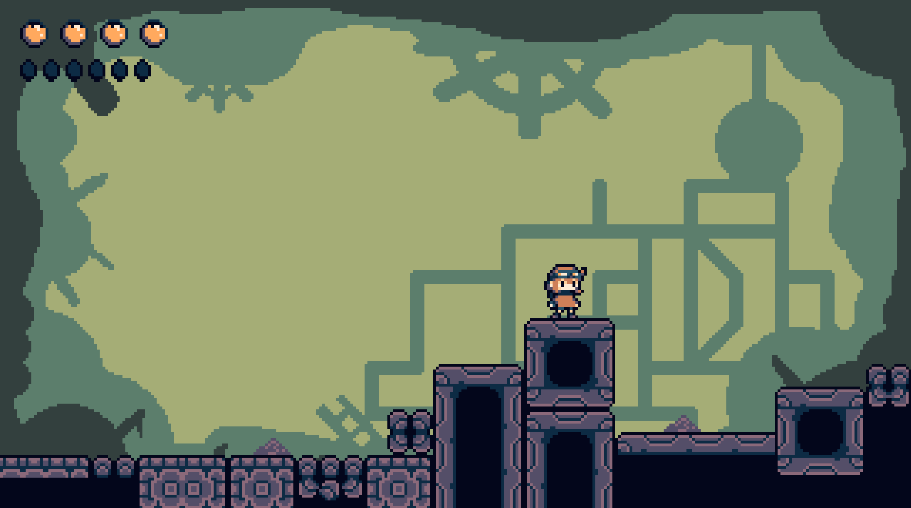
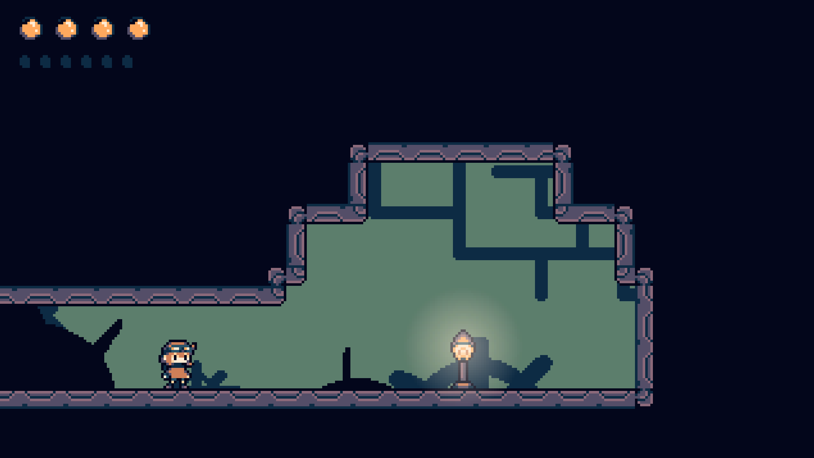
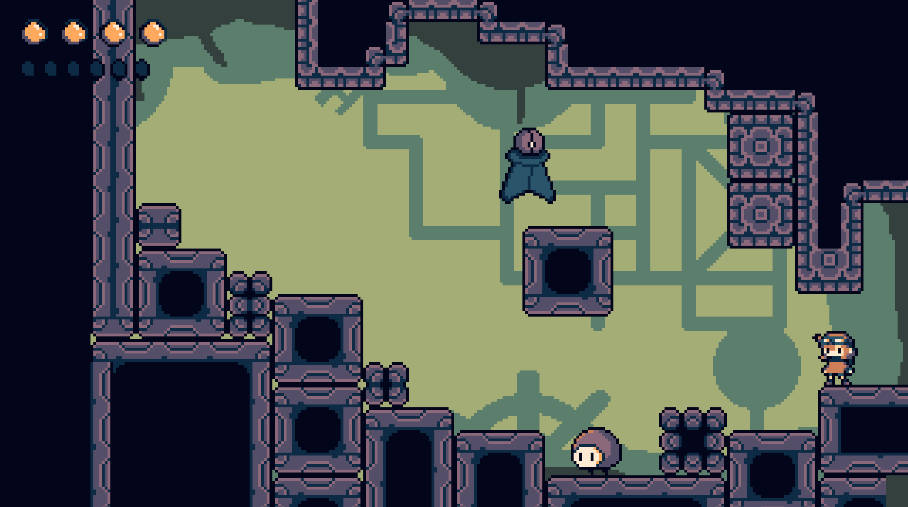

# 🌫️ Fogbound

**Fogbound** es un videojuego de plataformas 2D con estética retro pixel art, donde deberás abrirte paso entre la niebla, enemigos y obstáculos para completar todos los niveles.

---

## 🎮 About

> **"Fogbound es un juego retro de plataformas en 2D desarrollado en Unity y publicado para WebGL. Salta, esquiva y sobrevive a través de niveles llenos de enemigos, obstáculos y secretos en una aventura envuelta en niebla."**

---

## 🖼️ Capturas de Pantalla

  
  

---

## ⚙️ Detalles de Desarrollo

- **🎮 Motor:** Unity 2021.3.33f1 (URP)
- **🧠 Lenguaje:** C#

---

## 🎵 Créditos

### Música:

- *Sneaky Snitch* – Kevin MacLeod  
  Licencia: [CC BY 4.0](http://creativecommons.org/licenses/by/4.0/)

- *Evening Fall (Harp)* – Kevin MacLeod  
  Licencia: [CC BY 4.0](http://creativecommons.org/licenses/by/4.0/)

- *Foreign Galaxy* – Frank Schroeter  
  [Descargar](https://filmmusic.io/song/8414-foreign-galaxy) | Licencia: [CC BY 4.0](https://filmmusic.io/standard-license

### Fuentes:

- [Galmuri](https://galmuri.quiple.dev/)
- [DOS Saemmul](https://github.com/hurss/fonts)
- [Rounded M+ Fixedsys](https://cactus.tistory.com/193)
- [Neo 둥근모](https://neodgm.dalgona.dev/)
- [Original 둥근모](https://ith.kr/about/font.html)

